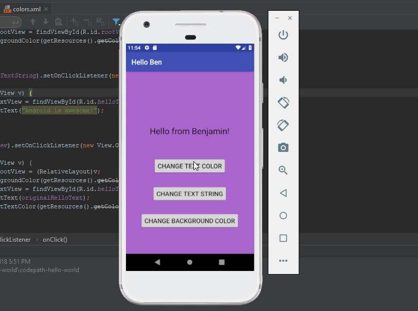

## HelloBen

### App Description

HelloBen is an application that prints the message 'Hello from Benajmin!' and
allows a user to modify the contents on the screen.

 

### Required User Stories

- [x] 1. User sees custom text in a lable - Hello from {name}!
- [x] 2. User sees custom background color.
- [x] 3. User can tap a button to change the text color of the label.

### Optional User Stories
- [x] 1. User can tap a button to change the color of the background view.
- [x] 2. User can tap a button to change the text string of the label - Android is Awesome!
- [x] 3. User can tap on the background view to reset all views to default settings.
- [ ] 4. User can update the label text with custom text entered into the text field.
   - [ ] a. User can enter text into a text field using the keyboard.
   - [ ] b. User can tap the "Change text string" button to update the label with the text from the text field.
   - [ ] c. If the text field is empty, update label with default text string.
